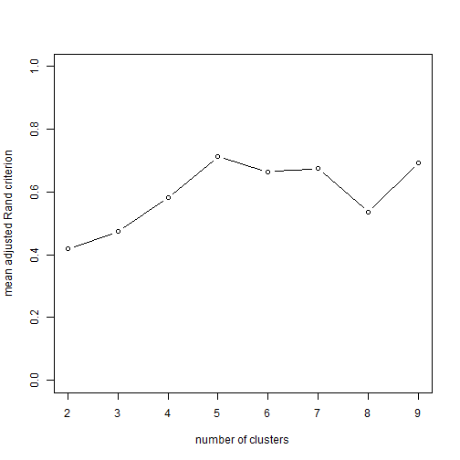
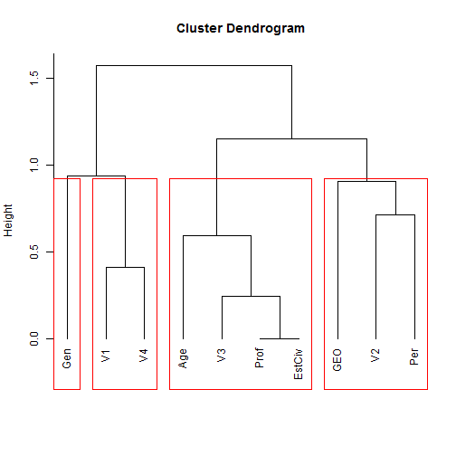
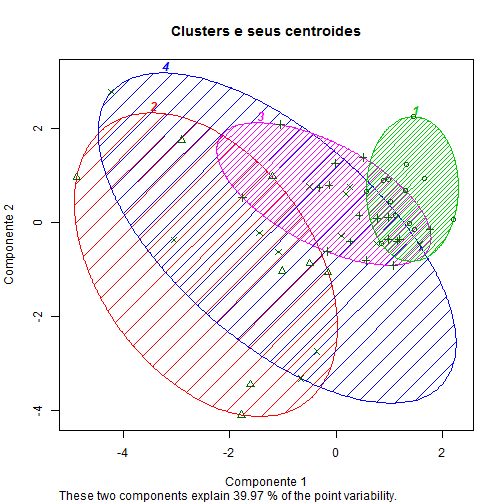
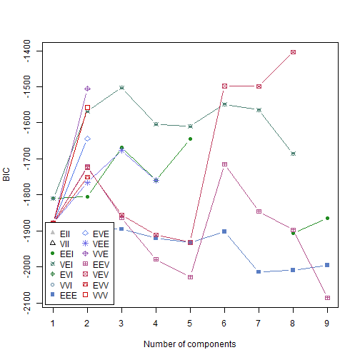
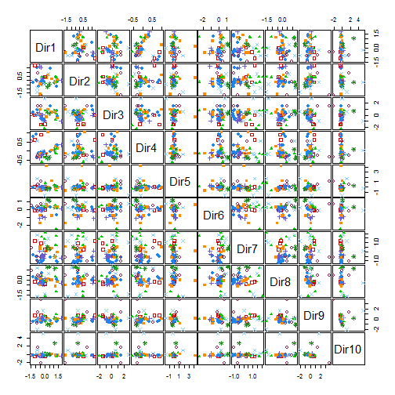
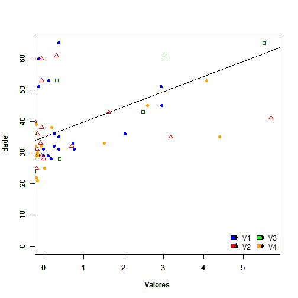

Customer Cluster Analysis
========================================================
author: Delermando Branquinho Filho
date: 23/02/2017
autosize: true

## Unsupervised Machine Learning

Dataset
========================================================

Amostra: 50


```
  ID        GEO Age                       Prof Gen      EstCiv
1  1  1.6716860  24       ANALISTA DE SISTEMAS   M SOLTEIRO(A)
2  2 -0.8308379  26 SERVIDOR PÚBLICO ESTADUAL   F SOLTEIRO(A)
3  3 -0.7670152  29       ANALISTA DE SISTEMAS   M SOLTEIRO(A)
            V1         V2         V3         V4 Per
1 -0.747185780 -0.2956822 -0.2357563 -0.3298533   A
2 -0.478976055 -0.3003984 -0.2646590 -0.3316147   A
3 -0.006416062 -0.3003984 -0.2646590 -0.1554677   A
```

========================================================
## Modelo hierarquico

** Numero de clusters


```
[1] 4
```

Grafico
========================================================




Dendrogram
========================================================



KMeans
========================================================




Clustering
========================================================



BIC - Bayesian Information Criterio
========================================================



Regressao Linear - Coeficientes
========================================================

```
(Intercept)   mydata$V1   mydata$V2   mydata$V3   mydata$V4 
 34.9000000   4.8563781   1.3112373   5.7855569  -0.6742793 
```

Regressao Linear - Sumario do modelo
========================================================

```

Call:
lm(formula = mydata$Age ~ mydata$V1 + mydata$V2 + mydata$V3 + 
    mydata$V4)

Residuals:
    Min      1Q  Median      3Q     Max 
-10.210  -5.611  -2.624   1.499  27.201 

Coefficients:
            Estimate Std. Error t value Pr(>|t|)    
(Intercept)  34.9000     1.2186  28.640  < 2e-16 ***
mydata$V1     4.8564     1.5632   3.107  0.00327 ** 
mydata$V2     1.3112     1.3137   0.998  0.32354    
mydata$V3     5.7856     1.2440   4.651 2.91e-05 ***
mydata$V4    -0.6743     1.6252  -0.415  0.68020    
---
Signif. codes:  0 '***' 0.001 '**' 0.01 '*' 0.05 '.' 0.1 ' ' 1

Residual standard error: 8.617 on 45 degrees of freedom
Multiple R-squared:  0.4485,	Adjusted R-squared:  0.3995 
F-statistic:  9.15 on 4 and 45 DF,  p-value: 1.696e-05
```

Regressao Linear - Grafico
========================================================

